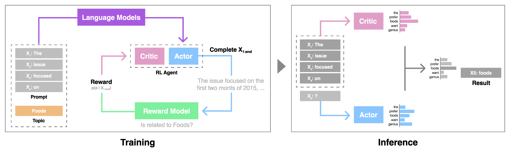

# CriticControl



This is the github repository of **"[Critic-Guided Decoding for Controlled Text Generation](https://aclanthology.org/2023.findings-acl.281/)"**, accepted at *ACL 2023 Findings*.

Use the following to cite our paper:

```
@inproceedings{kim-etal-2023-critic,
    title = "Critic-Guided Decoding for Controlled Text Generation",
    author = "Kim, Minbeom  and
      Lee, Hwanhee  and
      Yoo, Kang Min  and
      Park, Joonsuk  and
      Lee, Hwaran  and
      Jung, Kyomin",
    booktitle = "Findings of the Association for Computational Linguistics: ACL 2023",
    month = jul,
    year = "2023",
    address = "Toronto, Canada",
    publisher = "Association for Computational Linguistics",
    url = "https://aclanthology.org/2023.findings-acl.281",
    pages = "4598--4612",
    abstract = "Steering language generation towards objectives or away from undesired content has been a long-standing goal in utilizing language models (LM). Recent work has demonstrated reinforcement learning and weighted decoding as effective approaches to achieve a higher level of language control and quality with pros and cons. In this work, we propose a novel critic decoding method for controlled language generation (CriticControl) that combines the strengths of reinforcement learning and weighted decoding. Specifically, we adopt the actor-critic framework and train an LM-steering critic from reward models. Similar to weighted decoding, our method freezes the language model and manipulates the output token distribution using a critic to improve training efficiency and stability. Evaluation of our method on three controlled generation tasks, topic control, sentiment control, and detoxification, shows that our approach generates more coherent and well-controlled texts than previous methods. In addition, CriticControl demonstrates superior generalization ability in zero-shot settings. Human evaluation studies also corroborate our findings.",
}
```

## Create conda environment and install requirements
```
conda create -n CriticControl python=3.8 && conda activate CriticControl
pip install -r requirements.txt
```

## Train your own Control Codes
Both Topic and Sentiment Control require your own control code. For Topic Control Task, the default settings are in 'src/topic/*.txt'. In Sentiment Control, the default setting is not binary but only for 'Positive' steering. If you want to make it binary control, make control codes also for Sentiment Control task as Topic Control.

```
python3 topic_train.py --model_name gpt2-xl --steps 40000 --batch_size 32 --topic topic/topic.txt --prompt topic/prompt.txt
```

You can set any topic for your own Control Codes. In my paper, you can find that CriticControl can steer diverse themes anything!
